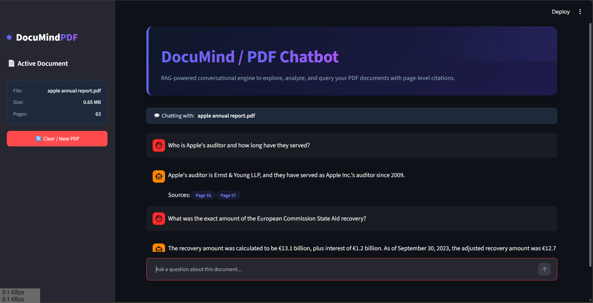

# DocuMind - PDF Chatbot (RAG Demo)

A modern, retrieval-augmented generation (RAG) web application that allows users to upload any PDF document, processes it locally, and answers questions based on the document's content with precise, page-level citations. Powered by Google Gemini models with fallback reliability.

---

## Features

1. **Vibrant & Responsive UI:** Designed with a modern, dark-themed indigo aesthetic (using glassmorphism, glowing pulse micro-animations, and clean typography).
2. **Robust RAG Pipeline:** Extracts document content, splits it into chunks preserving page metadata, generates high-quality embeddings, and stores them in a local Chroma vector database.
3. **Smart Re-upload Handling:** Computes file hashes to instantly load previously processed documents without parsing or re-embedding them.
4. **Conversational Memory:** Uses chat history to rephrase follow-up questions to query the vector store contextually.
5. **Model Fallback for High Reliability:** Attempts query answering via a primary model (`gemini-flash-lite-latest`), falling back automatically to a secondary model (`gemini-3.1-flash-lite`) if necessary, logging all execution details.
6. **Graceful Scanned Document Validation:** Detects whether a PDF is an image-only/scanned document (lacks selectable text) and alerts the user with helpful tips.
7. **Page-Level Citations:** Displays precise source page citations (e.g., *Page 3*, *Page 8*) below assistant replies.

---

## Project Structure

```text
pdf-chatbot/
├── app.py                  # Streamlit main application UI
├── config.py               # Settings loader (loads from .env)
├── document_processor.py   # PDF loading, scanned validation, chunking, and Chroma DB integration
├── rag_chain.py            # Retrieval and LLM QA chain (with primary/fallback logic)
├── logger.py               # Custom standard logging configuration (logs to app.log and stdout)
├── vector_store/           # Persisted Chroma database folder (Git ignored)
├── .env                    # Local API credentials and configurations (Git ignored)
├── .env.example            # Environment variables placeholder
├── .gitignore              # Ignored files (virtual envs, local db, credentials, logs)
├── requirements.txt        # Python package dependencies
└── README.md               # Project documentation
```

---

## Setup Instructions

### 1. Prerequisites
Ensure you have Python 3.11 or later installed on your system.

### 2. Clone the Repository
Clone the project repository to your local machine and navigate into the project directory:
```bash
git clone <repository-url>
cd Chatbot
```

### 3. Create a Virtual Environment
Create and activate a virtual environment to manage dependencies cleanly:
```bash
# Windows
python -m venv venv
venv\Scripts\activate

# macOS / Linux
python3 -m venv venv
source venv/bin/activate
```

### 4. Install Dependencies
Install all required libraries using pip:
```bash
pip install -r requirements.txt
```

> [!NOTE]
> **Python 3.14 Compatibility:** If you are running Python 3.14, due to a compatibility constraint with older versions of `tokenizers` pulled by `chromadb==0.5.23`, please follow the [Python 3.14 Compatibility Details](#python-314-compatibility-details) instructions below to install packages successfully.


### 5. Setup Environment Variables
Copy `.env.example` to a new file named `.env`:
```bash
cp .env.example .env
```
Open `.env` and fill in your Google Gemini API key:
```ini
GEMINI_API_KEY=your_actual_gemini_api_key_here
```

---

## Running the Application Locally

Run the Streamlit application using the command line:
```bash
streamlit run app.py
```
This will open the application in your default web browser (usually at `http://localhost:8501`).

---

## How to Deploy to Streamlit Community Cloud

Deploying your PDF Chatbot to Streamlit Community Cloud is simple:

1. **Push your code to GitHub:**
   Make sure you push your codebase to a public or private GitHub repository. (Verify that `.env`, `vector_store/`, and `venv/` are excluded by `.gitignore`).
2. **Log into Streamlit Community Cloud:**
   Go to [share.streamlit.io](https://share.streamlit.io/) and log in with your GitHub account.
3. **Deploy the App:**
   - Click **"New app"**.
   - Select your repository, branch, and specify `app.py` as the main file path.
   - Click **"Deploy"**.
4. **Configure Secrets:**
   - In your app's dashboard, go to **Settings** -> **Secrets**.
   - Paste your `.env` contents there (specifically the `GEMINI_API_KEY`):
     ```toml
     GEMINI_API_KEY = "your_actual_gemini_api_key"
     ```
   - Streamlit will automatically load these secrets into environment variables.

---

## 🔒 Privacy & Vector Storage Note

> [!IMPORTANT]
> **Data Storage Privacy Notice:**
> When you upload a PDF, this application processes its content and creates vector representations (embeddings) of the text. These embeddings, along with the text segments, are stored locally on your machine in the folder specified by `VECTOR_STORE_PATH` (default: `./vector_store/`).
> 
> * No documents or embeddings are uploaded to external database providers.
> * Your document contents are sent to Google Gemini APIs only to perform embeddings and to generate answers.
> * **Recommendation:** For maximum security when handling sensitive or confidential documents, we recommend periodically deleting the contents of the `vector_store/` directory on your local device.

---

## Screenshots

Here is the DocuMind user interface in action:




## Scaling Guide (Local vs. Google Embeddings)

By default, DocuMind uses free local embeddings (`sentence-transformers/all-MiniLM-L6-v2`) to provide fast, cost-free, and rate-limit-free PDF indexing suitable for normal/low traffic and demos. 

As your application scales for high-traffic production environments, you can switch to Google's paid embedding API without modifying any code:

1. **Enable Billing:** Ensure that your Google Gemini API key is associated with a paid billing account on Google AI Studio to handle high-throughput calls.
2. **Update Environment Configuration:** In your `.env` file, change the `EMBEDDING_PROVIDER` setting:
   ```ini
   EMBEDDING_PROVIDER=google
   ```
3. **Restart the Application:** Restart Streamlit for the configuration to take effect.

> [!WARNING]  
> **Automatic Re-indexing Note:** Because local embeddings and Google embeddings are not numerically compatible (they reside in different vector spaces), DocuMind automatically detects if the provider changes for a previously indexed PDF. The application will warn you in the console logs and automatically delete the incompatible collection, triggering a clean re-indexing of the document when accessed.

---

## 🔍 Hybrid Search (Semantic + BM25 Keyword Search)

To maximize retrieval accuracy, DocuMind features a **Hybrid Search** retrieval system.

### Why Hybrid Search?
* **Semantic Vector Search** excels at capturing the conceptual meaning, synonyms, and context of queries (e.g., "what are their sustainability plans").
* **BM25 Keyword Search** excels at exact matching for specific codes, numbers, names, and precise terms (e.g., CIK numbers, exact dollar figures, dates, or proper nouns) which embeddings can sometimes dilute or miss.

By combining both using an `EnsembleRetriever` and performing reciprocal rank fusion, the chatbot provides highly accurate answers for both conceptual and exact lookup questions.

### Configuration
You can control the retrieval mode and weights via your `.env` or `config.py` file:
* `RETRIEVAL_MODE`: Set to `hybrid` (default) to use hybrid search, or `semantic_only` to revert to standard vector search.
* `SEMANTIC_SEARCH_WEIGHT`: The weight given to the semantic retriever (default: `0.5`).
* `KEYWORD_SEARCH_WEIGHT`: The weight given to the BM25 keyword retriever (default: `0.5`).

The BM25 index is built from the same document chunks as the vector database and is cached on disk per document as a `.pkl` file in the `vector_store/` folder to prevent rebuilding from scratch on repeat uploads.

---

## Python 3.14 + Protobuf Compatibility Details

When deploying to Streamlit Community Cloud or running locally on **Python 3.14**, a known compatibility crash occurs during `chromadb`'s import chain (`TypeError: Descriptors cannot be created directly` / `_CheckCalledFromGeneratedFile` error).

Furthermore, because the `streamlit` command line tool itself imports `protobuf` during its boot-up sequence *before* reading the contents of `app.py`, adding `import patch_protobuf` to the top of `app.py` is not early enough to prevent the crash when starting via the CLI.

To resolve this issue, the codebase implements the following:
1. **Protobuf & OpenTelemetry Pinned Versions:** We explicitly pin exact versions of `protobuf==4.25.3`, `opentelemetry-api==1.25.0`, `opentelemetry-sdk==1.25.0`, and `opentelemetry-exporter-otlp-proto-grpc==1.25.0` in [requirements.txt](file:///G:/Chatbot/requirements.txt) to guarantee a compatible set of telemetry libraries.
2. **First-Line Environment Patching (`patch_protobuf.py` & `sitecustomize.py`):** Before importing any other module (including `streamlit`, `langchain`, or `chromadb`), the application imports [patch_protobuf.py](file:///G:/Chatbot/patch_protobuf.py) as the absolute first line. To handle CLI boot sequences, we also set `PROTOCOL_BUFFERS_PYTHON_IMPLEMENTATION=python` either via a `sitecustomize.py` hook inside the virtual environment's `site-packages` or by exporting it in the terminal shell before startup.
3. **Local Installation on Python 3.14:**
   Because `chromadb` requires `tokenizers<0.21`, standard pip resolution will try to compile an older version of `tokenizers` from source, which fails on Python 3.14. 
   
   To install dependencies successfully and configure the startup patch, run the following commands:
   ```bash
   # 1. Install tokenizers 0.23.1 (which has Python 3.14 wheels)
   pip install tokenizers==0.23.1
   
   # 2. Install requirements without resolving dependencies
   pip install -r requirements.txt --no-deps
   
   # 3. Create a startup customization patch inside the virtual environment
   python -c "import site; import os; open(os.path.join(site.getsitepackages()[0], 'sitecustomize.py'), 'w').write('import os\nos.environ[\"PROTOCOL_BUFFERS_PYTHON_IMPLEMENTATION\"] = \"python\"\n\nimport sys\nimport types\n\nif \"google.protobuf.internal.api_implementation\" not in sys.modules:\n    api_impl = types.ModuleType(\"google.protobuf.internal.api_implementation\")\n    api_impl.Type = lambda: \"python\"\n    api_impl.Version = lambda: 2\n    api_impl.IsPythonDefaultSerializationDeterministic = lambda: False\n    api_impl._implementation_type = \"python\"\n    api_impl._c_module = None\n    sys.modules[\"google.protobuf.internal.api_implementation\"] = api_impl\n')"
   ```
   
   Alternatively, you can manually set the environment variable in your terminal before running streamlit:
   ```powershell
   # Windows PowerShell
   $env:PROTOCOL_BUFFERS_PYTHON_IMPLEMENTATION="python"
   streamlit run app.py
   ```
   ```bash
   # Linux / macOS
   export PROTOCOL_BUFFERS_PYTHON_IMPLEMENTATION="python"
   streamlit run app.py
   ```
4. **Streamlit Community Cloud Deployment:**
   If deploying to a Streamlit Community Cloud environment running Python 3.14, configure the following environment variables in **Settings -> Secrets** to bypass the crash during app boot and allow successful builds:
   ```toml
   PROTOCOL_BUFFERS_PYTHON_IMPLEMENTATION = "python"
   PYO3_USE_ABI3_FORWARD_COMPATIBILITY = "1"
   ```

